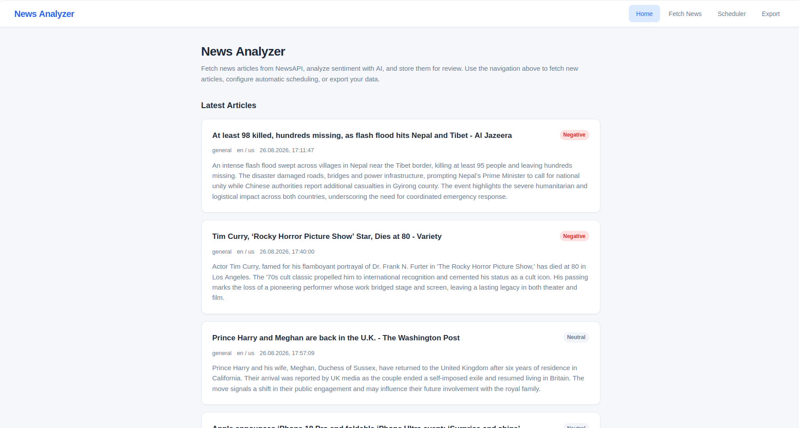
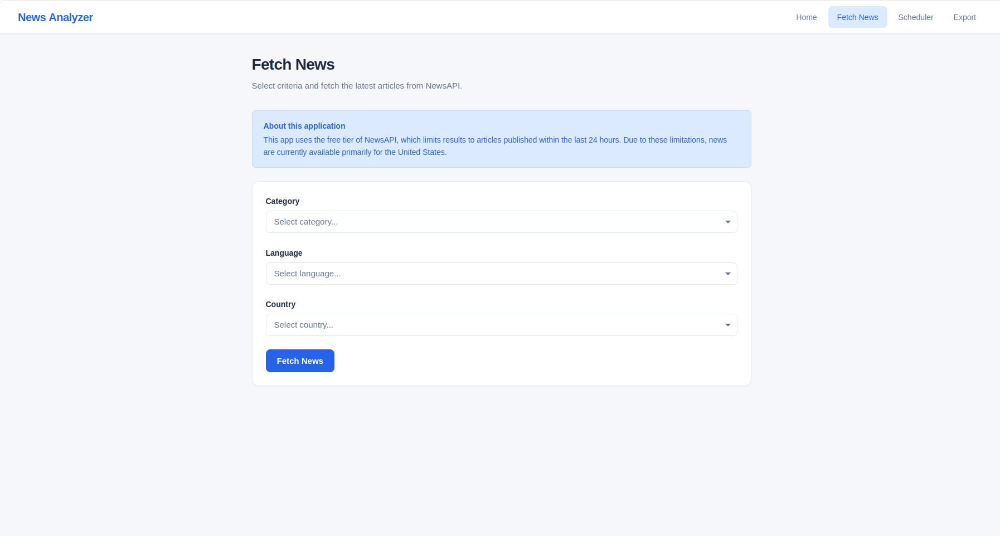
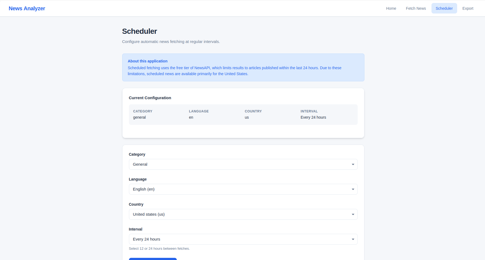
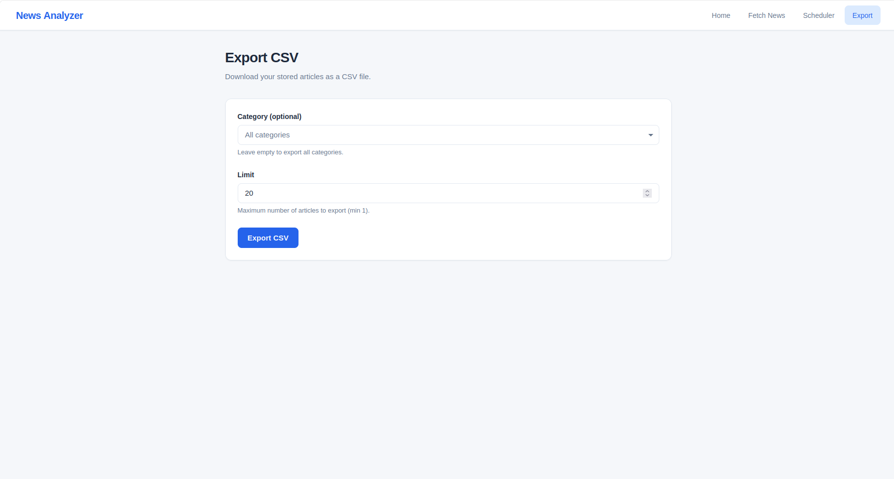
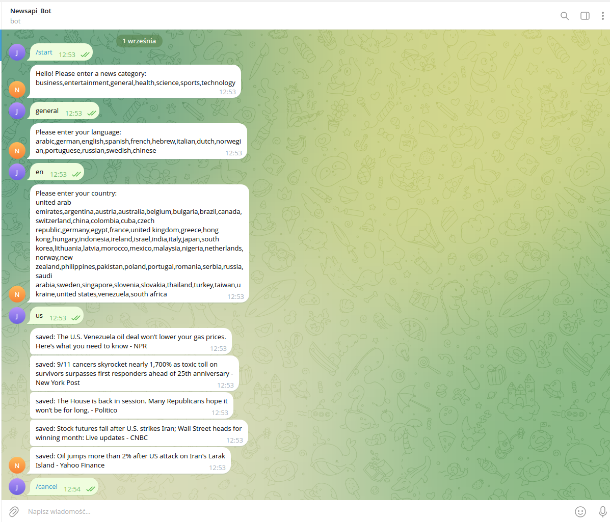

# ANALIZE-NEWS

An application that collects articles from NewsAPI, passes them to an AI for summarization, stores them in a database, and presents them to the user via an API, a Telegram bot or a CLI.

> **Note:** This is a **backend-focused** project. The simple web UI exists only to demonstrate the API, AI summarization, scheduler, and data handling — not as a polished frontend product.

## DEMO

  [▶ Watch the demo on YouTube](https://www.youtube.com/watch?v=c3rnn490QUU)

## FEATURES:

- **Homepage** - shows the five most recent articles; clicking one opens the full article.

  

- **Fetch news** - download up to 5 processed articles.

  

- **Scheduler** - automatic download/processing every 12 or 24 hours.

  

- **Export CSV** - export articles from the database as a `.csv` file, openable in Excel.

  

- **Telegram bot** - download and process 5 articles

   

- **Deployment** - two Docker containers (API + Telegram bot), plus a local CLI version.

## Limitations
The free NewsAPI tier has restrictions:
- articles are limited to the last **24 hours**,
- results are mostly available for the **United States**,
- this is why the app returns a small number of articles (5 per request)

## GETTING STARTED:
1. Clone the repository:

    ```bash
    git clone https://github.com/begginer1910/news-analizer-ai && cd news-analizer-ai
    ```

2. Create `.env` from the template and fill in your keys:

    ```bash
    cp .env.example .env
    ```

3. Build and run:

    _Prerequisites_: [Docker](https://www.docker.com) and _Docker Compose_ installed

    ```bash
    docker-compose up -d
    ```

## Architecture

Three entry points share the same SQLite database:
- **API** - FastAPI service exposing endpoints + built-in scheduler,
- **Telegram bot** - conversation flow to fetch and summarize news,
- **CLI** - terminal version.

All are built on the same core services: NewsAPI client, AI summarizer (Groq), and the storage layer.

## Tests

Run the test suite with pytest:
```bash
python -m pytest
```
Currently **118 tests**, all passing.

## Stack

Shows: async Python, clean layered architecture, third-party API integration (NewsAPI + Groq), automated scheduling, Telegram bot, Docker multi-container, and SQLite.

- FastAPI + Uvicorn
- Groq (AI summarization)
- NewsAPI
- APScheduler
- python-telegram-bot
- SQLite (aiosqlite)
- Docker

## Contact

- GitHub: [begginer1910](https://github.com/begginer1910)
- Email: przybylpawel24@gmail.com


